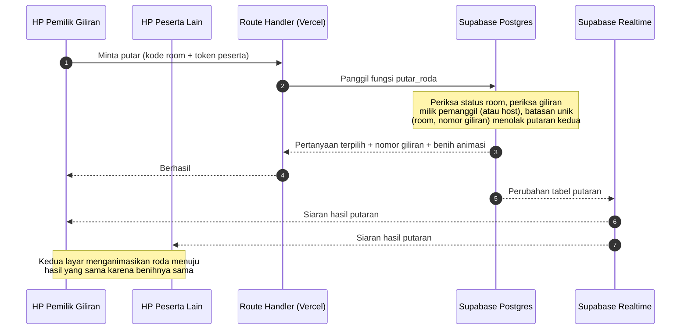
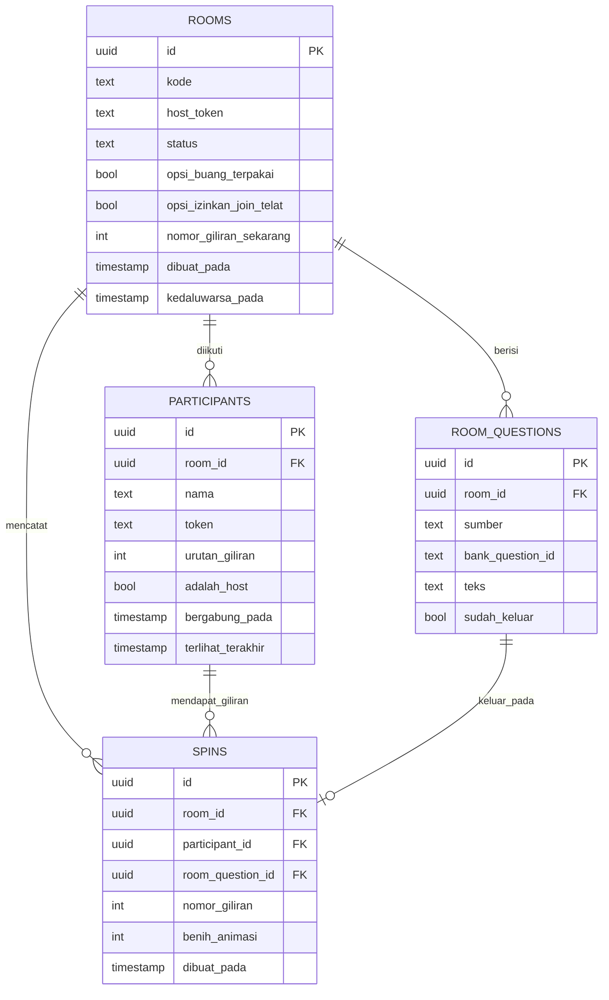

# PRD — Fellowship Games

**Fase 1: Roulette Bank Pertanyaan**
Tanggal dibuat: 2026-08-28

---

## 1. Overview

Sesi fellowship rutin sering macet di titik yang sama: butuh pemantik obrolan, tapi yang terpikir itu-itu saja, dan penunjukan siapa yang bicara terasa dipilih-pilih. Fellowship Games menyelesaikan itu dengan roda pertanyaan yang diputar bersama — pertanyaan diambil acak dari bank yang sudah disiapkan matang, dan giliran berjalan merata karena urutannya diacak di awal, bukan ditunjuk.

Aplikasinya dipakai oleh satu kelompok kecil (perkiraan 5–20 orang) yang berkumpul rutin. Perannya cair: siapa pun boleh membuat room dan menjadi host di sesi itu, sisanya bergabung sebagai peserta lewat kode room dari HP masing-masing. Tidak ada akun — cukup ketik nama.

Roulette pertanyaan adalah game pertama. Nama produknya sengaja "Fellowship Games", bukan "Roulette", karena game lain direncanakan menyusul dan tidak boleh menabrak nama produk.

---

## 2. Requirements

**Platform & akses**

- Web responsive, dibuka lewat browser HP tanpa pemasangan aplikasi. Target utama layar potret 360px; layar lebar didukung untuk host yang berbagi layar. Bukan aplikasi native, bukan PWA yang bisa dipasang.
- Tanpa akun dan tanpa login. Identitas hanya nama tampilan yang diketik saat masuk room, berlaku untuk sesi itu saja. Bukan profil yang tersimpan lintas sesi.
- Semua peserta membuka aplikasi di HP masing-masing dan melihat keadaan yang sama secara langsung. Tetap harus enak dipakai kalau ternyata cuma satu HP yang dipakai bersama.

**Model pengguna**

- Dua peran, ditentukan per room bukan per orang: **host** (pembuat room) dan **peserta**. Orang yang sama bisa jadi host di satu sesi dan peserta di sesi lain.
- Host punya kewenangan lebih: memutar mewakili giliran siapa pun, memindah giliran, menyisipkan pertanyaan saat sesi berjalan. Peserta hanya boleh memutar di gilirannya sendiri.
- Kewenangan host dijaga oleh token rahasia yang diberikan sekali saat room dibuat dan disimpan di browser host. Bukan kata sandi yang diketik, dan bukan pengecekan di sisi browser saja.

**Kepemilikan data pertanyaan**

- Bank pertanyaan dikelola developer lewat berkas di dalam repo, bukan lewat layar di aplikasi. Konsekuensi yang diterima sadar: menambah pertanyaan ke bank berarti mengubah berkas dan deploy ulang.
- Pertanyaan yang diketik sendiri saat membuat room atau saat sesi berjalan hidup di room itu saja dan ikut hilang setelah sesi selesai. Bukan jalur untuk menambah bank permanen.
- Bank berstruktur tepat dua tingkat: Tema → Sub-tema. Tidak ada tingkat ketiga, dan tidak ada label lintas tema di fase ini.
- Jumlah tema atau sub-tema yang dipilih saat membuat room tidak dibatasi. Boleh satu sub-tema, boleh seluruh bank.

**Biaya**

- Nol rupiah, tanpa kartu kredit, dan tanpa jalur yang bisa berubah jadi tagihan. Ini syarat mati, bukan preferensi. Setiap pilihan teknis di dokumen ini tunduk padanya.

**Batasan yang sengaja tidak dikerjakan di Fase 1**

- Tidak ada riwayat sesi yang tersimpan. Setelah sesi selesai, room dan isinya boleh hilang.
- Tidak ada pencarian pertanyaan. Pemilihan lewat penjelajahan tema, bukan pengetikan kata kunci.
- Peserta tidak bisa menyumbang pertanyaan. Hanya host.
- Tidak ada skor, tidak ada pencatatan siapa menjawab apa.

---

## 3. Peta Fitur

```mermaid
flowchart TD
    P["Fellowship Games"]

    subgraph FASE1["FASE 1 — Roulette Bank Pertanyaan"]
        direction TB
        B["Bank Pertanyaan"]
        B1["Struktur 2 tingkat: Tema-Sub tema"]
        B2["Seed 300-450 pertanyaan Indonesia"]
        B3["Tanpa layar kelola di aplikasi"]
        B --> B1
        B --> B2
        B --> B3

        C["Buat Room"]
        C1["Hasilkan kode room pendek"]
        C2["Jelajah bank: tema / sub-tema / satuan"]
        C3["Tulis pertanyaan sendiri"]
        C4["Opsi: pertanyaan terpakai dibuang"]
        C5["Opsi: izinkan bergabung setelah mulai"]
        C6["Mulai sesi: urutan peserta diacak"]
        C --> C1
        C --> C2
        C --> C3
        C --> C4
        C --> C5
        C --> C6

        D["Masuk Room"]
        D1["Masukkan kode room"]
        D2["Ketik nama tampilan"]
        D3["Lihat daftar peserta"]
        D4["Telat masuk: ditaruh di ekor antrean"]
        D --> D1
        D --> D2
        D --> D3
        D --> D4

        E["Sesi Roulette"]
        E1["Penanda giliran siapa sekarang"]
        E2["Tombol putar terkunci per giliran"]
        E3["Host boleh memutar mewakili siapa pun"]
        E4["Animasi roda berisi pertanyaan"]
        E5["Pertanyaan tampil di semua layar"]
        E6["Host sisipkan pertanyaan saat berjalan"]
        E7["Tombol Giliran berikutnya"]
        E8["Sisa pertanyaan dan tanda sesi selesai"]
        E --> E1
        E --> E2
        E --> E3
        E --> E4
        E --> E5
        E --> E6
        E --> E7
        E --> E8

        F["Sinkronisasi Realtime"]
        F1["Semua layar melihat putaran sama"]
        F2["Kunci anti dua putaran bersamaan"]
        F3["Peserta masuk/keluar terlihat langsung"]
        F4["Pulih setelah refresh / HP terkunci"]
        F --> F1
        F --> F2
        F --> F3
        F --> F4
    end

    subgraph FASE2["FASE 2 — Menyusul"]
        direction TB
        G["Kelola Bank dari Aplikasi"]
        G1["Layar tambah/ubah/hapus berkunci"]
        G2["Cari pertanyaan"]
        G3["Simpan pertanyaan sisipan ke bank"]
        G --> G1
        G --> G2
        G --> G3

        H["Peserta Menyumbang Pertanyaan"]
        H1["Kirim usulan dari HP peserta"]
        H2["Host setujui atau tolak"]
        H --> H1
        H --> H2

        I["Riwayat Sesi"]
        I1["Simpan hasil tiap sesi"]
        I2["Lihat pertanyaan yang pernah keluar"]
        I --> I1
        I --> I2

        J["Game Fellowship Lain"]
        J1["Pemilih game di lobi room"]
        J --> J1
    end

    P --> FASE1
    P --> FASE2
```



Versi bullet, kalau diagram di atas tidak ter-render:

```
Fellowship Games
│
├── FASE 1 — Roulette Bank Pertanyaan
│   ├── Bank Pertanyaan (file statis di repo, dikelola developer)
│   │   ├── Struktur 2 tingkat: Tema → Sub-tema
│   │   ├── Seed 300-450 pertanyaan berbahasa Indonesia
│   │   └── Tanpa layar kelola di aplikasi (sengaja)
│   ├── Buat Room
│   │   ├── Hasilkan kode room pendek
│   │   ├── Jelajah bank: centang per tema, per sub-tema, atau satuan
│   │   ├── Tulis pertanyaan sendiri (hidup di room ini saja)
│   │   ├── Opsi: pertanyaan terpakai dibuang dari roda
│   │   ├── Opsi: izinkan bergabung setelah sesi dimulai
│   │   └── Mulai sesi (urutan peserta diacak saat ini)
│   ├── Masuk Room
│   │   ├── Masukkan kode room
│   │   ├── Ketik nama tampilan
│   │   ├── Lihat daftar peserta yang sudah masuk
│   │   └── Yang telat masuk ditaruh di ekor antrean
│   ├── Sesi Roulette
│   │   ├── Penanda "sekarang giliran siapa"
│   │   ├── Tombol putar aktif hanya untuk pemilik giliran
│   │   ├── Host boleh memutar mewakili giliran siapa pun
│   │   ├── Animasi roda berisi pertanyaan
│   │   ├── Pertanyaan terpilih tampil di semua layar
│   │   ├── Host sisipkan pertanyaan baru saat sesi berjalan
│   │   ├── Tombol "Giliran berikutnya" (host)
│   │   └── Sisa pertanyaan & tanda sesi selesai
│   └── Sinkronisasi Realtime
│       ├── Semua layar melihat putaran yang sama
│       ├── Kunci anti dua putaran bersamaan
│       ├── Peserta masuk/keluar terlihat langsung
│       └── Pulih ke keadaan benar setelah refresh / HP terkunci
│
└── FASE 2 — Menyusul
    ├── Kelola Bank dari Aplikasi
    │   ├── Layar tambah/ubah/hapus berkunci kata sandi
    │   ├── Cari pertanyaan
    │   └── Simpan pertanyaan sisipan ke bank permanen
    ├── Peserta Menyumbang Pertanyaan
    │   ├── Kirim usulan dari HP peserta
    │   └── Host setujui atau tolak
    ├── Riwayat Sesi
    │   ├── Simpan hasil tiap sesi
    │   └── Lihat pertanyaan yang pernah keluar
    └── Game Fellowship Lain
        └── Pemilih game di lobi room
```

---

## 4. Core Features

### 4.1 Bank Pertanyaan — Fase 1

Kumpulan pertanyaan permanen yang ikut kode program, bukan isi database. Ini yang membuat bank tidak bisa diacak-acak siapa pun yang punya kode room.

**Struktur 2 tingkat**
Setiap pertanyaan wajib punya: `id` yang stabil dan tidak pernah didaur ulang, `tema`, `sub_tema`, dan `teks`. Tepat dua tingkat — tidak ada sub-sub-tema. Sebuah pertanyaan berada di tepat satu sub-tema, tidak bisa muncul di dua tempat.

**Seed 300–450 pertanyaan berbahasa Indonesia**
Target sebaran: sekitar 10 tema, masing-masing 3–5 sub-tema, masing-masing 8–12 pertanyaan. Contoh bentuk tema/sub-tema: ROHANI → Iman, Doa, Keraguan; KELUARGA → Masa Kecil, Hal Lucu, Konflik; DIRI SENDIRI → Ketakutan, Impian, Kebiasaan. Semua pertanyaan berbahasa Indonesia dan bernada percakapan, bukan bahasa dokumen.

Sebelum dipakai di sesi sungguhan, seed wajib dibaca sekali oleh pemilik project dan yang terlalu menusuk untuk kelompoknya dicoret. Ini pekerjaan sekali di awal, bukan tiap sesi.

**Tanpa layar kelola di aplikasi**
Tidak ada halaman tambah/ubah/hapus pertanyaan di Fase 1. Mengubah bank berarti mengubah berkas dan deploy ulang. Kalau di pemakaian nyata ternyata bank perlu ditambah lebih sering dari sekali sebulan, keputusan ini salah dan layar kelola berkunci harus ditarik naik dari Fase 2.

### 4.2 Buat Room — Fase 1

**Hasilkan kode room pendek**
Kode 5 karakter huruf besar, diambil dari himpunan yang membuang karakter mirip (tanpa O, 0, I, 1, L) supaya tidak salah dibaca saat disebut lisan. Kode unik di antara room yang masih hidup.

**Jelajah bank: centang per tema, per sub-tema, atau satuan**
Layar penjelajahan berbentuk accordion: tema bisa dibuka untuk melihat sub-temanya, sub-tema bisa dibuka untuk melihat pertanyaannya. Tiga tingkat pencentangan: centang tema mengambil semua isinya, centang sub-tema mengambil semua pertanyaan di dalamnya, centang satuan mengambil satu pertanyaan. Jumlah terpilih terlihat terus di layar. Tidak ada batas jumlah tema atau sub-tema.

**Tulis pertanyaan sendiri**
Kotak isian bebas untuk menambah pertanyaan yang tidak ada di bank. Pertanyaan ini masuk ke kolam room dan diperlakukan setara dengan pertanyaan bank saat diputar. Tidak masuk ke bank permanen.

**Opsi: pertanyaan terpakai dibuang dari roda**
Sakelar. Menyala berarti pertanyaan yang sudah keluar tidak bisa keluar lagi dan sesi berakhir saat kolam habis. Mati berarti pertanyaan boleh keluar berulang dan sesi tidak punya titik habis.

**Opsi: izinkan bergabung setelah sesi dimulai**
Sakelar. Mati berarti room terkunci begitu sesi dimulai dan pendatang baru ditolak dengan pesan yang jelas, bukan layar error.

**Mulai sesi: urutan peserta diacak**
Pengacakan terjadi tepat sekali, pada saat host menekan Mulai. Urutan hasil acak itu tetap sampai sesi selesai — tidak diacak ulang tiap putaran, supaya semua orang bisa melihat kapan gilirannya datang.

### 4.3 Masuk Room — Fase 1

**Masukkan kode room**
Isian kode di halaman depan. Huruf kecil otomatis dijadikan huruf besar. Kode yang tidak ada dijawab dengan pesan yang membedakan "kode salah" dari "sesi sudah ditutup".

**Ketik nama tampilan**
Wajib diisi, 1–20 karakter. Nama yang bentrok dengan peserta lain di room yang sama ditolak dan diminta dibedakan, karena penanda giliran memakai nama dan nama kembar membuatnya ambigu. Nama diingat di browser masing-masing supaya sesi berikutnya tidak perlu mengetik ulang.

**Lihat daftar peserta yang sudah masuk**
Daftar nama peserta di ruang tunggu, bertambah dan berkurang secara langsung tanpa perlu memuat ulang halaman.

**Yang telat masuk ditaruh di ekor antrean**
Peserta yang bergabung setelah sesi dimulai menempati posisi terakhir dalam urutan giliran, bukan disisipkan acak. Alasannya dipegang: penyisipan acak bisa memberi giliran kedua kepada orang yang sudah lewat sementara ada yang belum sama sekali, dan itu persis rasa tidak adil yang mau dihilangkan aplikasi ini.

### 4.4 Sesi Roulette — Fase 1

**Penanda giliran siapa sekarang**
Nama pemilik giliran ditampilkan mencolok di semua layar. Di layar pemilik giliran sendiri, penandanya berbeda dan jelas menyatakan "giliranmu", bukan sekadar namanya muncul.

**Tombol putar terkunci per giliran**
Tombol putar hanya bisa ditekan oleh pemilik giliran. Di layar orang lain tombol itu terlihat tapi mati, sehingga semua orang paham mekanismenya tanpa dijelaskan. Penguncian ditegakkan di sisi server, bukan cuma dengan mematikan tombol di browser.

**Host boleh memutar mewakili siapa pun**
Host selalu bisa menekan putar, termasuk saat giliran orang lain. Ini jalan keluar untuk keadaan nyata: peserta HP-nya mati, sinyalnya hilang, atau memang sedang tidak memegang HP.

**Animasi roda berisi pertanyaan**
Roda menampilkan pertanyaan-pertanyaan di kolam room dan berputar sebelum berhenti di satu pertanyaan. Hasilnya ditentukan lebih dulu di server, lalu semua layar menganimasikan roda menuju hasil yang sama. Kalau jumlah pertanyaan terlalu banyak untuk digambar di roda, roda menampilkan sebagian sebagai wakil visual, tapi pengundian tetap dari seluruh kolam.

**Pertanyaan terpilih tampil di semua layar**
Setelah roda berhenti, teks pertanyaan ditampilkan besar dan terbaca dari jarak baca HP di tangan orang lain.

**Host sisipkan pertanyaan baru saat sesi berjalan**
Host bisa mengetik pertanyaan baru di tengah sesi. Pertanyaan itu masuk kolam untuk putaran berikutnya, dan tidak bisa dipaksa keluar sekarang juga. Alasannya dipegang: kalau host bisa memaksa pertanyaan tertentu keluar, orang akan curiga pertanyaan itu diarahkan ke orang tertentu, dan roda kehilangan seluruh maknanya.

**Tombol "Giliran berikutnya"**
Hanya host. Sesi tidak berpindah giliran sendiri setelah roda berhenti, supaya obrolan boleh melebar tanpa dikejar aplikasi.

**Sisa pertanyaan & tanda sesi selesai**
Jumlah pertanyaan tersisa terlihat saat opsi buang-terpakai menyala. Saat kolam habis, semua layar berpindah ke tampilan sesi selesai, bukan roda kosong yang membingungkan.

### 4.5 Sinkronisasi Realtime — Fase 1

**Semua layar melihat putaran yang sama**
Hasil putaran, perpindahan giliran, dan perubahan daftar peserta sampai ke semua layar tanpa dimuat ulang.

**Kunci anti dua putaran bersamaan**
Ditegakkan lewat batasan keunikan di database pada pasangan (room, nomor giliran), bukan lewat penjagaan di kode aplikasi. Kalau host dan pemilik giliran menekan putar pada saat nyaris bersamaan, satu berhasil dan satu ditolak — dan yang ditolak tetap melihat hasil yang sama, bukan pesan error.

**Peserta masuk/keluar terlihat langsung**
Daftar peserta di ruang tunggu maupun di dalam sesi mencerminkan keadaan sekarang.

**Pulih ke keadaan benar setelah refresh / HP terkunci**
Membuka ulang halaman atau membuka kunci HP setelah lama mengembalikan peserta ke keadaan sesi yang sedang berjalan, lengkap dengan pertanyaan terakhir yang keluar dan giliran siapa sekarang. Identitas peserta dipulihkan dari token di browser, tanpa perlu mengetik nama lagi.

---

## 5. User Flow

Alur satu siklus kerja utama, dari nol sampai sesi selesai.

1. **Host membuka aplikasi.** Halaman depan menawarkan dua jalan: Buat Room dan Masuk Room.
2. **Host memilih Buat Room.** Layar penjelajahan bank terbuka: accordion tema, buka tema untuk melihat sub-tema, buka sub-tema untuk melihat pertanyaan. Host mencentang gabungan tema, sub-tema, atau pertanyaan satuan sesuka hati. Penghitung pertanyaan terpilih terlihat terus.
3. **Host menambah pertanyaan sendiri (opsional)** lewat kotak isian bebas di layar yang sama.
4. **Host mengatur dua sakelar:** pertanyaan terpakai dibuang atau tidak, dan boleh bergabung setelah mulai atau tidak.
5. **Host menekan Buat.** Sistem menghasilkan kode 5 karakter, menyimpan kolam pertanyaan room, dan memberi host token rahasia yang disimpan di browsernya. Host masuk ke ruang tunggu dan menyebutkan kodenya ke teman-teman.
6. **Peserta membuka aplikasi, memilih Masuk Room,** mengetik kode dan nama, lalu masuk ke ruang tunggu. Namanya muncul di layar semua orang seketika.
7. **Host menekan Mulai Sesi.** Urutan peserta diacak sekali di sini. Semua layar berpindah dari ruang tunggu ke layar sesi.
8. **Layar sesi menunjukkan giliran siapa sekarang.** Pemilik giliran melihat tombol putar hidup; yang lain melihatnya mati.
9. **Pemilik giliran menekan putar** (atau host menekan mewakilinya). Server menentukan pertanyaan, menolak putaran kedua untuk giliran yang sama, lalu menyiarkan hasilnya.
10. **Semua roda berputar menuju hasil yang sama dan berhenti.** Teks pertanyaan tampil besar di semua layar. Orang yang dapat giliran menjawab, obrolan berjalan bebas.
11. **Host menekan Giliran Berikutnya** saat obrolan selesai. Giliran pindah ke orang berikutnya dalam urutan acak. Kalau ada yang baru bergabung, dia ada di ekor antrean.
12. **Langkah 8–11 berulang** sampai kolam pertanyaan habis (kalau opsi buang-terpakai menyala) atau sampai host mengakhiri sesi.
13. **Semua layar berpindah ke tampilan sesi selesai.** Room boleh dibiarkan hilang.

---

## 6. Architecture

Alur data untuk operasi paling inti: satu putaran roda yang harus sampai serentak dan sama ke semua layar.



Tiga keputusan arsitektur yang menentukan bentuk sisanya:

**Bank pertanyaan tidak masuk database.** Bank adalah berkas data statis yang ikut dibundel ke aplikasi. Konsekuensinya database hanya mengurus keadaan room, dan layar penjelajahan bank tidak perlu memanggil server sama sekali. Ini yang membuat "dikelola developer" punya arti teknis yang tepat, bukan sekadar aturan yang bisa dilanggar.

**Teks pertanyaan disalin ke kolam room, bukan dirujuk lewat id saja.** Room menyimpan salinan teksnya. Alasannya: bank bisa berubah lewat deploy, dan room yang cuma menyimpan id bisa menampilkan teks berbeda atau pertanyaan hilang di tengah sesi. Salinan membuat room utuh sendiri. Id bank tetap disimpan untuk penelusuran.

**Sinkronisasi lewat Supabase Realtime langsung dari browser, bukan polling ke server.** Ini bukan pilihan gaya, tapi pilihan biaya: polling tiap detik dengan 10 peserta selama satu jam menghabiskan sekitar 36.000 pemanggilan fungsi per sesi, dan jatah gratis Vercel adalah 1 juta per bulan — habis dalam hitungan beberapa kali kumpul. Realtime memindahkan beban itu ke koneksi WebSocket yang tidak menyentuh Vercel sama sekali.

---

## 7. Database Schema

Konseptual. Hanya keadaan room; bank pertanyaan tidak ada di sini.



**ROOMS** — satu baris per sesi. `kode` unik di antara room yang belum kedaluwarsa; boleh dipakai ulang setelahnya. `host_token` rahasia yang diberikan sekali saat room dibuat dan disimpan di browser host — inilah yang membuktikan kewenangan host, bukan pengecekan di browser. `status` bernilai `lobby`, `berjalan`, atau `selesai`. `nomor_giliran_sekarang` naik satu setiap kali host menekan Giliran Berikutnya. `kedaluwarsa_pada` dipakai untuk membersihkan room lama secara berkala supaya database gratis 500 MB tidak terisi sampah.

**PARTICIPANTS** — satu baris per orang per room. `token` rahasia yang disimpan di browser peserta, dipakai untuk membuktikan identitas saat memutar dan untuk memulihkan sesi setelah refresh. `urutan_giliran` kosong selama masih di ruang tunggu, diisi saat host menekan Mulai; peserta yang bergabung setelah itu mendapat nilai satu lebih besar dari yang tertinggi, sehingga otomatis berada di ekor. `nama` unik di dalam satu room.

**ROOM_QUESTIONS** — kolam pertanyaan milik satu room. `sumber` bernilai `bank` atau `custom`. `bank_question_id` hanya terisi untuk yang berasal dari bank dan berguna untuk penelusuran, bukan untuk mengambil teksnya. `teks` selalu terisi — ini salinan yang membuat room utuh sendiri. `sudah_keluar` dipakai kalau opsi buang-terpakai menyala.

**SPINS** — riwayat putaran di dalam sesi. Pasangan (`room_id`, `nomor_giliran`) diberi batasan unik, dan batasan inilah kunci anti dua putaran bersamaan — bukan penjagaan di kode aplikasi, yang selalu bisa kalah oleh dua permintaan yang datang nyaris bersamaan. `benih_animasi` disimpan supaya setiap layar, termasuk yang baru memuat ulang halaman, bisa menggambar posisi roda yang sama.

**Akses langsung ke tabel ditutup.** Karena tidak ada login, penulisan ke tabel tidak boleh dibuka ke browser. Semua aksi yang mengubah keadaan (bergabung, mulai, putar, pindah giliran, sisip pertanyaan) lewat fungsi di database yang memeriksa token, dan browser hanya diberi izin membaca baris milik room yang kodenya dia ketahui.

---

## 8. Design & Technical Constraints

**Stack**

| Lapis | Pilihan | Alasan |
|---|---|---|
| Aplikasi | Next.js (App Router) + TypeScript | Satu repo untuk halaman dan sisi server, deploy langsung ke Vercel |
| Tampilan | Tailwind CSS | Cepat untuk responsive, tidak menambah layanan |
| Data & realtime | Supabase (Postgres + Realtime) | Gratis, realtime bawaan, tanpa kartu kredit |
| Hosting | Vercel Hobby | Gratis selamanya, tanpa kartu kredit |

**Batasan biaya — syarat mati**

- Vercel Hobby tidak bisa membeli kuota tambahan. Saat limit tercapai layanan berhenti, tidak menagih. Ini yang menjamin nol rupiah, dan karena itu jangan pernah menyambungkan metode pembayaran ke akunnya.
- Hobby hanya untuk pemakaian non-komersial. Fellowship masuk; kalau suatu saat ada iklan, pembayaran, atau dipakai untuk kerja klien, syarat ini batal.
- Supabase gratis: 500 MB database, 2 project aktif, tanpa kartu kredit.

**Batasan operasional yang tidak boleh disembunyikan**

Project Supabase gratis dipause setelah 7 hari tanpa aktivitas database, dan membangunkannya butuh sekitar 30 detik lewat dashboard. Untuk fellowship mingguan hampir tak terasa; untuk yang sebulan sekali, pasti kena. Penangkalnya gratis: satu Vercel Cron harian yang menulis ke database. Ini harus dipasang di potongan pertama Build Order, bukan ditunda, karena kalau ditunda ketahuannya justru saat sesi mau mulai.

**Batasan tampilan**

- Layar potret HP 360px adalah target utama, bukan tambahan. Layar lebar didukung untuk host yang berbagi layar.
- Semua sasaran sentuh minimal 44px. Tombol putar jauh lebih besar dari itu — ini tombol yang ditekan orang sambil ditonton, dan meleset terasa memalukan.
- Teks pertanyaan harus terbaca dari jarak orang lain memegang HP-nya, bukan cuma dari jarak baca sendiri.
- Animasi roda memakai transform CSS, bukan gambar per bingkai, supaya tetap mulus di HP kelas menengah.
- Hormati pengaturan "kurangi animasi" di perangkat: roda tetap memberi hasil, tapi tanpa putaran panjang.
- Seluruh antarmuka berbahasa Indonesia, bernada percakapan.

**Batasan teknis lain**

- Tanpa akun dan tanpa kata sandi di Fase 1. Kewenangan bersandar pada token rahasia di browser dan kode room.
- Kode room adalah satu-satunya rahasia yang melindungi sebuah sesi. Ini disadari dan diterima: taruhannya rendah, dan gesekan login lebih merugikan daripada risikonya.

---

## 9. Definisi Berhasil

Satu sesi fellowship berjalan penuh dari membuat room sampai pertanyaan habis, dengan setiap peserta memakai HP-nya sendiri, tanpa host perlu menjelaskan cara memakainya dan tanpa seorang pun jatuh ke layar error atau perlu memuat ulang halaman. Di sesi kedua, bank pertanyaan tidak perlu disentuh sama sekali — host cukup mencentang tema dan langsung mulai. Dan sepanjang itu, tidak ada satu rupiah pun yang keluar.

---

## 10. Build Order

Enam potongan berurutan. Setiap potongan menghasilkan sesuatu yang bisa dibuka dan diuji langsung, bukan yang cuma selesai secara teknis.

### Potongan 1 — Tulang punggung yang sudah online

Next.js kosong dengan satu halaman depan, tersambung ke Supabase, dideploy ke Vercel dan menghasilkan URL publik yang bisa dibuka dari HP. Termasuk Vercel Cron harian yang menulis ke database supaya project Supabase tidak dipause.

*Bisa diuji:* buka URL dari HP, halaman muncul, dan satu tombol uji membuktikan sambungan ke database hidup.
*Sengaja belum ada:* room, roda, bank pertanyaan, tampilan yang bagus.

### Potongan 2 — Room yang hidup dan berisi orang

Buat room menghasilkan kode. Masuk room lewat kode dan nama. Daftar peserta di ruang tunggu bertambah dan berkurang secara langsung di semua HP. Token host dan token peserta sudah dipakai sejak sini.

*Bisa diuji:* buka dari dua HP, kode dari HP pertama dipakai HP kedua, dan nama peserta kedua muncul di HP pertama tanpa dimuat ulang.
*Sengaja belum ada:* bank pertanyaan, roda, giliran, opsi room.

### Potongan 3 — Roda yang berputar serentak

Kolam pertanyaan diisi dari daftar contoh kecil yang ditulis langsung di kode, bukan bank penuh. Tombol putar, animasi roda, hasil yang sama di semua layar, dan batasan unik anti dua putaran bersamaan.

*Bisa diuji:* dua HP menekan putar hampir bersamaan; satu berhasil, satu ditolak, dan keduanya melihat pertanyaan yang sama berhenti di roda.
*Sengaja belum ada:* giliran, opsi room, bank penuh, pertanyaan tulis sendiri.

### Potongan 4 — Giliran dan aturan sesi

Urutan diacak saat Mulai. Tombol putar terkunci per giliran dan ditegakkan di server. Host boleh memutar mewakili siapa pun. Tombol Giliran Berikutnya. Opsi izinkan bergabung setelah mulai, dengan pendatang baru masuk ke ekor antrean.

*Bisa diuji:* tiga HP; hanya pemilik giliran yang tombolnya hidup, HP keempat bergabung di tengah dan muncul di posisi terakhir antrean.
*Sengaja belum ada:* bank penuh, pertanyaan sisipan saat sesi berjalan.

### Potongan 5 — Bank pertanyaan penuh dan pemilihannya

Seed 300–450 pertanyaan dua tingkat sebagai berkas statis. Layar penjelajahan accordion dengan pencentangan tema, sub-tema, dan satuan. Kotak tulis pertanyaan sendiri saat membuat room. Opsi pertanyaan terpakai dibuang, lengkap dengan penghitung sisa dan tampilan sesi selesai.

*Bisa diuji:* buat room dengan mencentang dua tema penuh dan satu pertanyaan satuan, jalankan sampai kolam habis, layar selesai muncul di semua HP.
*Sengaja belum ada:* pertanyaan sisipan saat sesi berjalan, penghalusan tampilan.

### Potongan 6 — Penghalusan sesi

Host menyisipkan pertanyaan saat sesi berjalan. Pemulihan keadaan setelah memuat ulang halaman atau membuka kunci HP. Perapian tampilan potret HP, ukuran sentuh, ukuran teks pertanyaan, dan penghormatan pada pengaturan kurangi animasi.

*Bisa diuji:* di tengah sesi, matikan layar HP peserta selama beberapa menit lalu buka lagi — dia kembali ke giliran dan pertanyaan yang benar tanpa mengetik nama ulang.
*Sengaja belum ada:* semua isi Fase 2.

Fase 2 tidak diurutkan di sini. Urutannya akan berubah setelah Fase 1 dipakai di sesi sungguhan dan kenyataan bicara.

---

## Catatan Perubahan

**2026-08-28 — Cron anti-pause: GitHub Actions mingguan → Vercel Cron harian.**
Terpengaruh: bagian 8 (Batasan operasional) dan bagian 10 (Potongan 1).
*Alasan:* versi semula menuntut repo GitHub sudah ada berikut penyimpanan rahasianya, padahal Prasyarat tidak pernah menyebut itu dan deploy pertama bisa jalan lewat `vercel` CLI langsung dari lokal tanpa GitHub sama sekali. Vercel Cron hanya butuh empat baris di `vercel.json` dan memakai variabel lingkungan yang sudah didaftarkan. Satu layanan lebih sedikit di hari pertama, dan frekuensinya justru naik dari mingguan jadi harian.

**2026-08-28 — Ditegaskan: route penahan pause harus MENULIS, bukan membaca.**
Terpengaruh: bagian 8 (Batasan operasional).
*Alasan:* Supabase menghitung perubahan data sebagai aktivitas; permintaan baca saja belum tentu menahan project dari dipause. Kalau tidak ditulis eksplisit, pelaksana akan membuat endpoint `select` yang tampak bekerja tapi diam-diam gagal menahan pause, dan ketahuannya justru saat sesi mau mulai.
